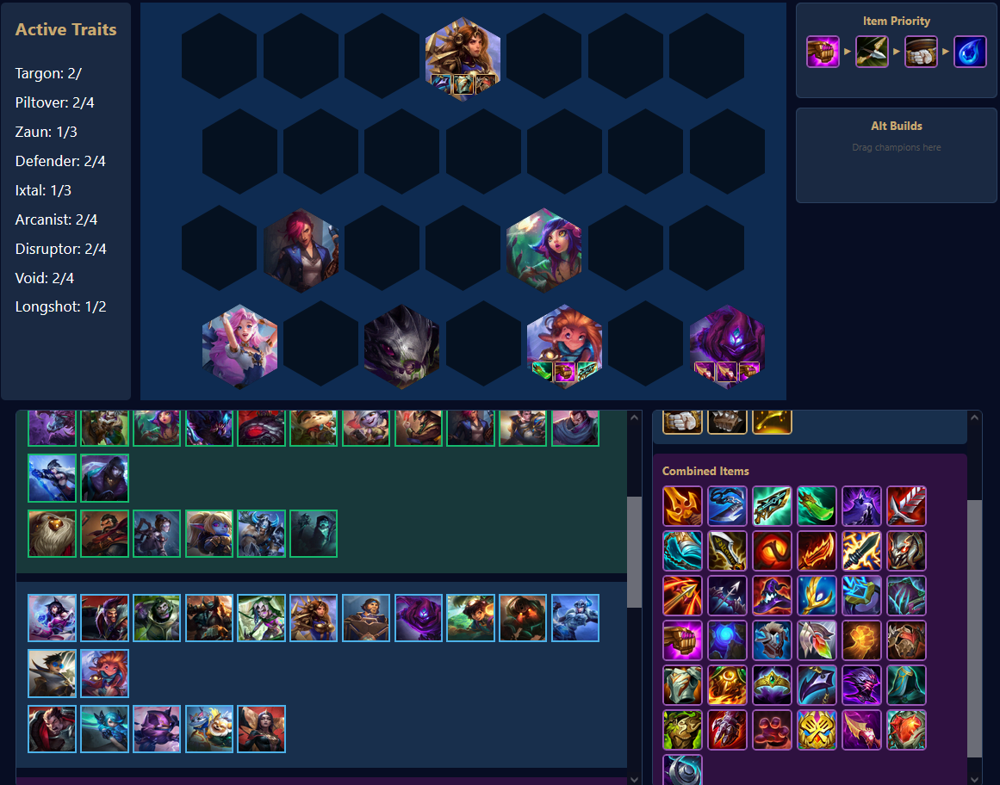

# TFT Team Comp Builder

<<<<<<< HEAD
A full-stack team composition builder for Teamfight Tactics. Browse champions by cost and traits, drag and drop them onto a hex board, and track active trait synergies in real time.



## Tech Stack

- **Frontend:** React (drag-and-drop UI, dynamic filtering)
- **Backend:** FastAPI (REST API with Pydantic validation)
- **Database:** PostgreSQL (SQLAlchemy ORM, many-to-many relationships)
- **DevOps:** Docker, Docker Compose, GitHub Actions CI/CD

## Features

- Browse and filter 60+ champions by cost tier and trait
- Drag and drop champions onto a 4x7 hex board
- Swap champion positions by dragging between hexes
- Real-time trait synergy tracking with breakpoint indicators
- RESTful API with automatic documentation at `/docs`

## Getting Started

### With Docker (recommended)
```bash
# Clone the repo
git clone https://github.com/JonathanRaguine/TFT.git
cd TFT

# Create .env file in the project root
echo "DB_PASSWORD=yourpassword" > .env

# Start everything
docker-compose up --build

# In a new terminal, seed the database
docker exec -it tft-backend-1 python seed_traits.py
docker exec -it tft-backend-1 python seed_items.py
```

Then open http://localhost:3000

### Without Docker
```bash
# Backend
cd backend
pip install -r requirements.txt
# Create backend/.env with DB_PASSWORD=yourpassword
uvicorn main:app --reload

# Frontend (in a new terminal)
cd frontend
npm install
npm start
```

## API Endpoints

| Method | Endpoint | Description |
|--------|----------|-------------|
| GET | `/champions` | List all champions with traits |
| GET | `/champions/{id}` | Get a single champion |
| GET | `/traits` | List all traits |
| GET | `/docs` | Interactive API documentation |

## Running Tests
```bash
cd backend
python -m pytest test_main.py -v
```

Tests also run automatically on every push via GitHub Actions.

## Database Schema

Champions and Traits share a many-to-many relationship through a junction table, allowing each champion to have multiple traits and each trait to belong to multiple champions.
=======
Full-stack app for building TFT team compositions.

## Tech Stack
- FastAPI
- React
- PostgreSQL

## Setup
1. Create `.env` with `DB_PASSWORD=yourpassword`
2. `pip install -r requirements.txt`
3. `uvicorn main:app --reload`
>>>>>>> cc000b02f178f3440c0de6240ccda5d8d80a6949
