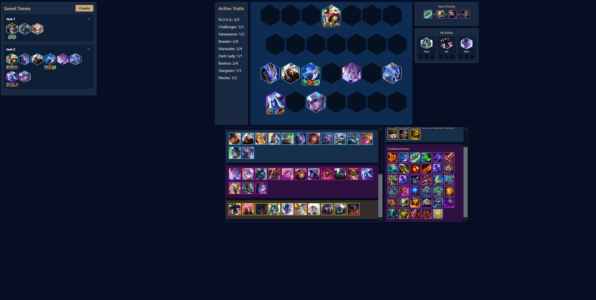

# TFT Team Comp Builder

A full-stack team composition builder for Teamfight Tactics. Browse champions by cost and traits, drag and drop them onto a hex board, and track active trait synergies in real time.

**Live site:** https://teambuilderplanner.cc



## Tech Stack

- **Frontend:** React (drag-and-drop UI, dynamic filtering)
- **Backend:** FastAPI (REST API with Pydantic validation)
- **Database:** PostgreSQL (SQLAlchemy ORM, many-to-many relationships), hosted on Amazon RDS
- **DevOps:** Docker, Docker Compose, GitHub Actions CI/CD, AWS (EC2, RDS, CloudWatch, SNS, IAM, SSM), Cloudflare

## Features

- Browse and filter 60+ champions by cost tier and trait
- Drag and drop champions onto a 4x7 hex board
- Swap champion positions by dragging between hexes
- Real-time trait synergy tracking with breakpoint indicators
- RESTful API with automatic documentation at `/docs`

## Architecture


- **Cloudflare** handles DNS, TLS termination, and proxies traffic to the origin server. An Origin Rule routes `api.teambuilderplanner.cc` to port 8080 on the origin, separate from the frontend on port 80.
- **EC2** runs both containers (frontend and backend) via Docker Compose, behind a stable Elastic IP.
- **RDS** runs PostgreSQL, provisioned with no public access — only reachable from the EC2 instance over the VPC's internal network.
- **GitHub Actions** deploys automatically on every push to `main`, connecting to EC2 through **AWS Systems Manager (SSM)** rather than SSH. This avoids opening port 22 to GitHub's runner IP ranges, which change and aren't practical to allowlist.
- **CloudWatch** monitors the instance's status checks; an alarm notifies me by email (via SNS) if the instance becomes unreachable.

## CI/CD pipeline

On every push to `main`:
1. Tests run automatically via GitHub Actions.
2. A separate deploy workflow authenticates to AWS using a scoped IAM user (SSM permissions only).
3. It sends a command via `aws ssm send-command` to the EC2 instance.
4. The instance pulls the latest code and rebuilds the Docker containers.

No manual deployment step required once code is pushed to `main`.

## Security notes

- RDS has no public endpoint; only the EC2 instance can reach it.
- SSH (port 22) is restricted to a single known IP.
- The deploy pipeline uses SSM instead of SSH, so no inbound port needs to stay open for GitHub's infrastructure.
- Ports 80 and 8080 are scoped to Cloudflare's published IP ranges rather than left open to `0.0.0.0/0`, so traffic can't bypass Cloudflare's proxy and hit the origin directly.

## Getting Started

### With Docker
```bash
# Clone the repo
git clone https://github.com/JonathanRaguine/TFT.git
cd TFT

# Create .env file in the project root
echo "DB_PASSWORD=yourpassword" > .env

# Create frontend/.env pointing at your local backend
echo "REACT_APP_API_URL=http://localhost:8000" > frontend/.env

# Start everything
docker compose up -d --build

# Create tables, then seed the database
docker exec -it tft-backend-1 python create_tables.py
docker exec -it tft-backend-1 python seed_api.py
docker exec -it tft-backend-1 python seed_items.py
```

Then open http://localhost:3000

### Without Docker
```bash
# Backend
cd backend
pip install -r requirements.txt
# Create backend/.env with DB_PASSWORD=yourpassword
uvicorn main:app --reload

# Frontend (in a new terminal)
cd frontend
npm install
npm start
```

## API Endpoints

| Method | Endpoint | Description |
|--------|----------|-------------|
| GET | `/champions` | List all champions with traits |
| GET | `/champions/{id}` | Get a single champion |
| GET | `/traits` | List all traits |
| GET | `/docs` | Interactive API documentation |

## Running Tests
```bash
cd backend
python -m pytest test_main.py -v
```

Tests also run automatically on every push via GitHub Actions.

## Database Schema

Champions and Traits share a many-to-many relationship through a junction table, allowing each champion to have multiple traits and each trait to belong to multiple champions. Production data is hosted on Amazon RDS; local development uses a containerized PostgreSQL instance with the same schema.

## What I learned building this

- **Free tier vs. Free Plan**: AWS's traditional 750-hours-per-service free tier and its newer credit-based Free Plan are different systems — worth checking which one actually applies to your account before planning around hour limits.
- **Docker networking gotchas**: hardcoded `localhost` URLs work fine locally and break silently once deployed — the fix is environment variables wired through `docker-compose.yml`'s `env_file`, not hardcoded IPs.
- **CORS and mixed content**: moving to HTTPS meant the API also had to be served over HTTPS, or browsers block the requests outright.
- **SSH vs. SSM for CI/CD**: SSH is simpler to set up but requires opening port 22 to arbitrary GitHub runner IPs. SSM avoids that, at the cost of more initial IAM setup.
- **RDS deletion is permanent** — unlike stopping an EC2 instance, deleting an RDS instance without a snapshot means the data is gone.
- **Elastic IPs aren't free while stopped** — only while attached to a running instance.
